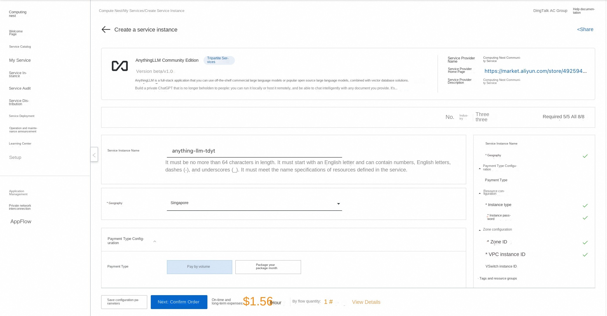
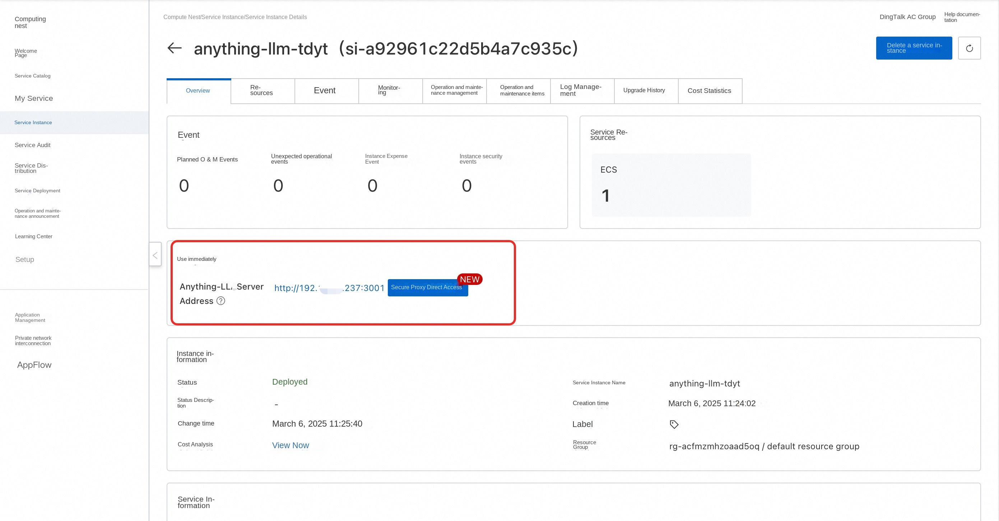
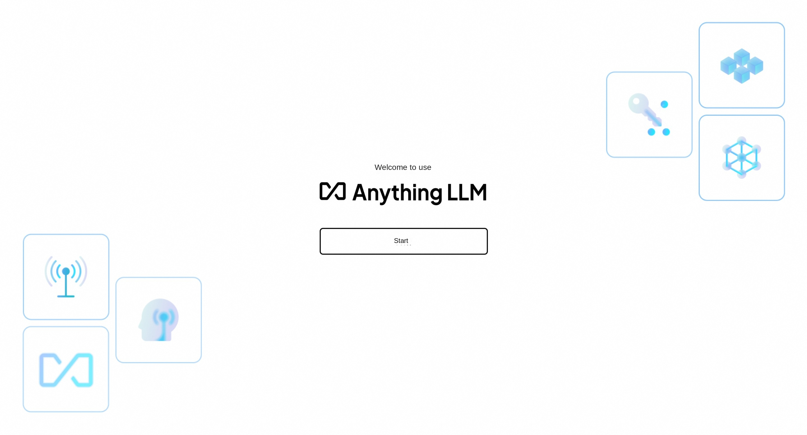

# AnythingLLM Community Edition Quick Deployment

## Overview

AnythingLLM is a full-stack application, you can use an off-the-shelf commercial big language model or a popular open source big language model, combined with a vector database solution to build a private ChatGPT that is no longer subject to human control: you can run it locally or host it remotely, and you can chat intelligently with any document you provide. AnythingLLM divide your document into objects called workspaces (workspaces). The function of the workspace is similar to the thread, while increasing the containerization of the document. Workspaces can share documents, but the content between workspaces does not interfere or pollute each other, so you can keep the context of each workspace clear.

## Prerequisites

To deploy the AnythingLLM Community Edition service instance, you need to access and create some Alibaba Cloud resources. Therefore, your account must contain permissions for the following resources.
**Note**: This permission is required only when your account is a RAM account.

| Permission policy name | Comment |
| ------------------------------------- | ------------------------ |
| AliyunECSFullAccess | Permissions to manage ECS instances |
| AliyunVPCFullAccess | Permissions to manage a VPC |
| AliyunROSFullAccess | Manage permissions for Resource Orchestration Service (ROS) |
| AliyunComputeNestUserFullAccess | Manage user-side permissions for the compute nest service (ComputeNest) |

## Billing Description

The cost of AnythingLLM Community Edition deployment in Computing Nest mainly involves:

-Selected vCPU and memory specifications
-System disk type and capacity
-public network bandwidth

## Deployment process

1. Visit the Computing Nest AnythingLLM Community Edition [Deployment Link](https://computenest.console.aliyun.com/service/instance/create/cn-hangzhou?type=user&ServiceName=AnythingLLM社区版) and fill in the deployment parameters as prompted:

2. After completing the parameters, you can see the corresponding RFQ details. After confirming the parameters, click **Next: Confirm Order**.

3. Confirm that the order is complete and agree to the service agreement and click **Create Now** to enter the deployment phase.

4. After the deployment is complete, you can start using the service. Enter the details of the service instance and click **Security Agent Direct Access**.

5. After loading, you can use the AnythingLLM service.

## Use Help
For more usage, please refer to [AnythingLLM official documents](https://docs.anythingllm.com/).